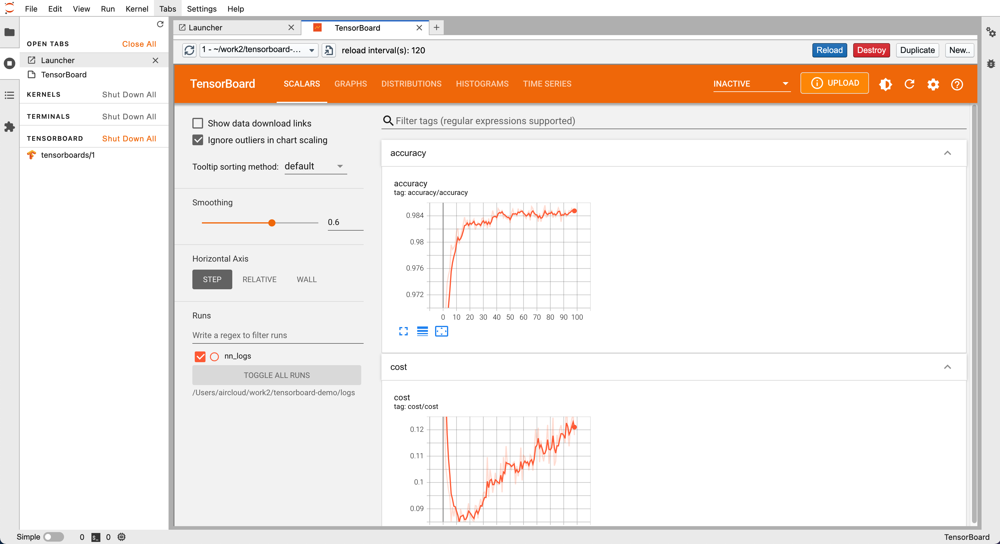
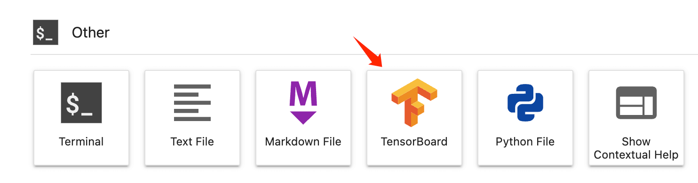
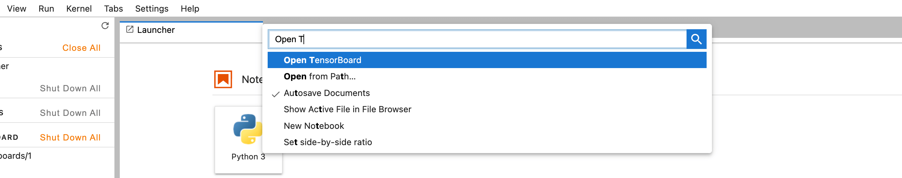
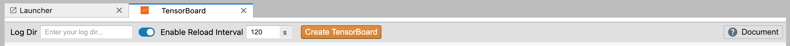
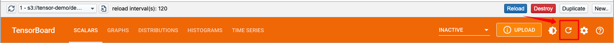

# JupyterLab-TensorBoard-Pro

&nbsp;[](https://pypi.org/project/jupyterlab-tensorboard-pro/)

[中文文档](./README.zh-cn.md)

A TensorBoard JupyterLab plugin.



## Requirements

**python >= 3.6**

Please install the following dependencies before installing this project:

- jupyterlab
- tensorflow
- tensorboard

## Install

```
pip install jupyterlab-tensorboard-pro
```

> only jupyterlab support, not include notebook

## Background

In fact, there are already [jupyterlab_tensorboard](https://github.com/chaoleili/jupyterlab_tensorboard) (front-end plugin) and [jupyter_tensorboard](https://github.com/lspvic/jupyter_tensorboard) (back-end plugin) in the community, but both repositories have not been updated for a long time, and some new repair PRs have not been merged in time. Based on this, maybe the project author is no longer actively maintaining the corresponding repositories.

At the same time, the existing community TensorBoard plugin has some experience problems, such as installing two python packages at the same time, no response for a long time after clicking `TensorBoard`, and the TensorBoard Reload time cannot be set. The interactive experience is not friendly enough, which will also affect the user's JupyterLab experience.

Therefore, this project is forked from the existing projects of the community, and we made some positive changes, contained some previous PRs which are helpful but have not been merged for the time being. This repo will to be maintained for a long time in the future.

This repo has also changed the api name, so it can be completely independent of the above plugins.

Special thanks to the developers of the previous related repositories.

## Instructions

### Create Instance

#### Create from Launcher Panel

We can click the TensorBoard icon from the Launcher panel, the first click will take you to a default initialization panel from which we can create a TensorBoard instance. But if there is an active TensorBoard backend at this time, it will be opened directly.



#### Create by Shortcut Command

We can also type `Open TensorBoard` in the JupyterLab shortcut panel (evoked by `ctrl + shift + c`)



#### Parameters

In the initialization panel, two parameters are provided:

- **Log Dir**: The default is the **relative directory** of the current sidebar when TensorBoard is clicked. You can also manually fill in the corresponding directory. It is recommended to make the directory as detailed as possible. If the directory content is small, the initialization speed will be improved.
- **Reload Interval**: How often does TensorBoard backend rescan the corresponding directory. This option is set to 120 seconds by default. But it is recommended to disable and use manually Reload for daily use (The continuous scanning of directories by the TensorBoard backend will have some impact on Jupyter's stability and file system).

Select the parameters and click Create TensorBoard, and the TensorBoard instance will be created synchronously. At this time, the jupyter backend is **blocking**, please wait for the instance to be created before performing other operations.



### Manage Instances

After the instance of TensorBoard is created, we can manage the instance. Currently, the following functions are provided:

- **Refresh and list all**: TensorBoard backends can be switched to other instances (won't destroy the before)
- **Open in a separate page**: You can open TensorBoard in the form of a separate web page tab.
- **Reload**: Reinitialize the TensorBoard backend. When the content of the file is updated, you can load the new content through this function (Note: The refresh inside TensorBoard will not cause Reload).
- **Destroy**: Destroy the instance, it will close both the backend and the frontend panel.
- **Duplicate**: Open an identical frontend panel, this operation will reuse the TensorBoard backend.
- **New**: Create an additional TensorBoard backend, please refer to the above for precautions.

In addition, for the TensorBoard instance we created, it can be managed in the Kernel management panel of Jupyter, providing functions such as jumping to the corresponding instance and deleting.


### Use AWS S3

> It is assumed here that you have some experience with aws s3

TensorBoard supports passing an s3 path via `s3://path/to/dir`, which is also supported in this plugin.

However, because the s3 path is usually not directly accessible, you need to configure some basic information through `aws configure` ([download](https://docs.aws.amazon.com/cli/latest/userguide/getting-started-install.html) aws cli), Usually, the system where JupyterLab is running should have the following files:

```shell
# ~/.aws/config
[default]
region = ap-southeast-1
output = json

# ~/.aws/credentials
[default]
aws_access_key_id = ********
aws_secret_access_key = ********
```

Then you need to install some additional dependencies:

```
pip install botocore boto3 tensorflow-io
```

After that, you can enter an s3 path, then click the refresh button of tensorboard, and wait the loading:



> In fact, the status prompt of tensorboard itself is not friendly now, and we will further investigate whether there is a better way to experience it later.

## Debug

You can use `jupyter-lab --debug` to enable debug logging for JupyterLab and TensorBoard.

## Develop

```shell
jlpm install
pip install jupyter_packaging
jlpm run install:client
jlpm run install:server
ln -s /path/to/jupyterlab_tensorboard_pro/jupyterlab_tensorboard_pro
# after above maybe you need create use a soft link to hot update
```

watch frontend:
```
jlpm run watch
```

build:
```
python setup.py bdist_wheel --universal
```

Under normal circumstances, you can just submit MR, the developers of this project will package and publish to pypi.